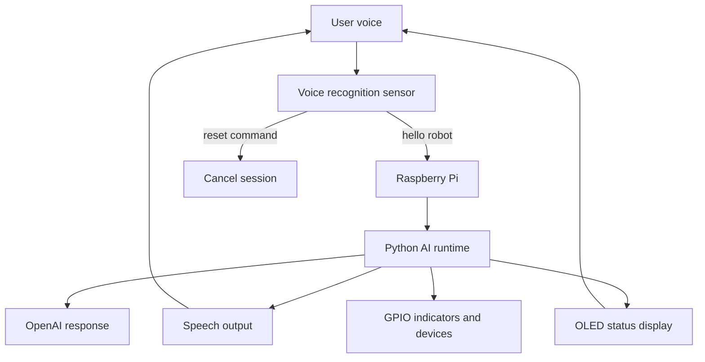

# Smart Voice Home Assistant

A Raspberry Pi voice-controlled home assistant that uses a voice recognition sensor, OpenAI, an OLED status display, GPIO indicators, and local automation scripts.

## Project Overview

This project builds a small smart-home assistant device around a Raspberry Pi. The device listens for the wake phrase `hello robot`, starts a voice interaction session, sends user speech to an AI runtime, speaks back to the user, and shows system status on an OLED screen. It also uses GPIO-connected indicators and devices so the assistant can show or control real physical output.

The goal is to combine a simple embedded hardware interface with modern AI software. The device is designed to be useful as a hands-free assistant while still being practical for a low-cost Raspberry Pi build.

## Objectives and Goals

- Build a voice-activated home assistant using Raspberry Pi hardware.
- Use a dedicated recognition sensor for wake and reset commands.
- Integrate OpenAI-powered responses for natural conversation.
- Show live status on a small OLED display.
- Control physical outputs such as fan and status LEDs through GPIO.
- Document the design, wiring, testing, results, and lessons learned in a professional project format.

## Current Capabilities

- Wake phrase detection with `hello robot`.
- Reset command support.
- Voice interaction session after wake activation.
- OpenAI-powered response flow through the Python runtime.
- OLED display showing agent name, role, network status, current action, and recent transcript.
- GPIO-ready hardware status indicators.
- Remote Raspberry Pi workflow using SSH, PuTTY, and RealVNC.

## System Architecture



## Repository Sections

This repository is organized like a project report website, following the same major section style as the provided Espresso project example.

| Section | Description |
| --- | --- |
| [Final Presentation / Video](docs/final-presentation/) | Final presentation outline and demo video placeholder. |
| [Flow Charts](docs/flowcharts/) | System flowchart and voice interaction flow. |
| [BOM](docs/bom/) | Bill of materials and component purposes. |
| [Mechanical Build](docs/mechanical-build/) | Physical device build and enclosure notes. |
| [Electrical](docs/electrical/) | Wiring, GPIO, serial sensor, and OLED notes. |
| [Simulation / Results](docs/simulation-results/) | Testing results, working features, and issues found. |
| [Code](src/) | Main Python script and run instructions. |
| [Progress Reports](docs/progress-reports/) | Weekly progress summary and original status report PDF. |
| [CAD](docs/cad/) | CAD and enclosure planning notes. |

## Key Hardware

- Raspberry Pi 3 / Raspberry Pi 4 development target
- DFRobot DF2301Q voice recognition sensor
- USB lavalier microphone
- OLED display using I2C
- Fan output
- Red and green GPIO status indicators
- microSD card with Raspberry Pi OS
- SSH / RealVNC remote access setup

## Key Software

- Python 3
- OpenAI-powered AI runtime
- DFRobot DF2301Q UART library
- `luma.oled` for OLED rendering
- Serial communication over Raspberry Pi UART
- Optional local AI experiments with Vosk, Whisper, Piper, Ollama, Qwen, and OpenClaw

## Demo and Results Summary

The current prototype can detect the wake command, enter an active assistant session, show status on the OLED display, and route the conversation through the AI runtime. The project also documents earlier testing with Vosk speech recognition, microphone debugging, OpenClaw/local AI experiments, and the migration from Raspberry Pi 4 to Raspberry Pi 3 due to hardware loss.

## Main Script

The current main script is:

```text
src/voice_test_openai.py
```

It configures the voice sensor, starts the OpenAI runtime, updates OLED status callbacks, handles wake/reset command IDs, and keeps the device listening in a loop.

## Project Status

The project is documentation-ready and prototype-ready. Missing final items are clearly marked in the documentation pages, including final demo video, final CAD/enclosure files, and exact BOM pricing where prices are not known.
