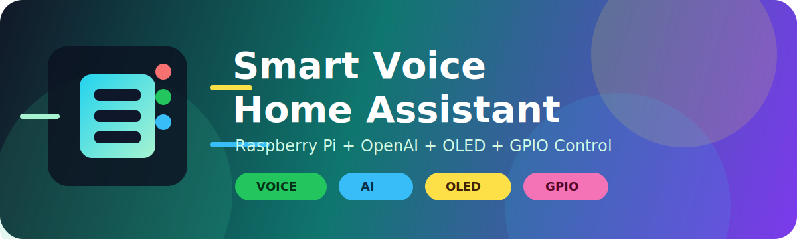
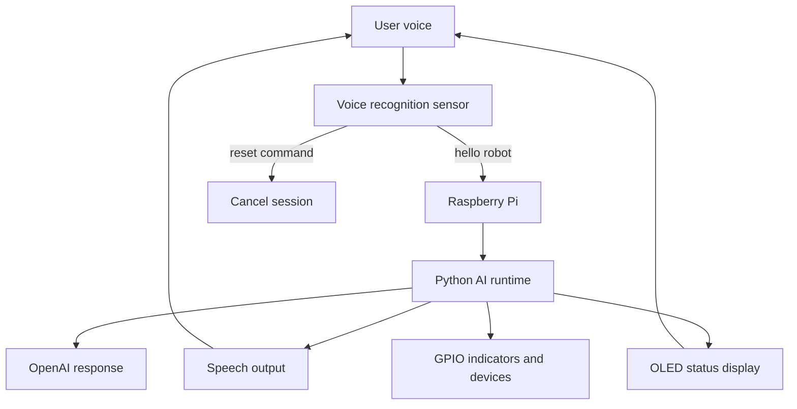
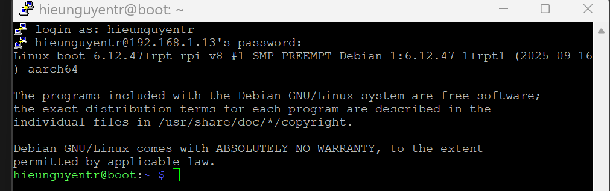
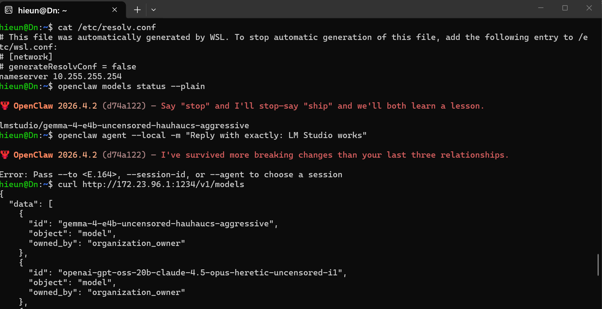
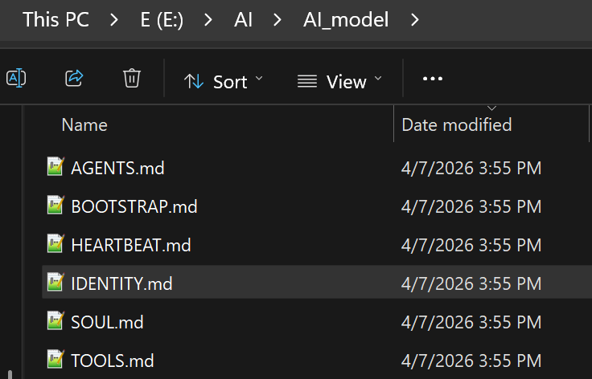

<p align="center">
  
</p>

<h1 align="center">Smart Voice Home Assistant</h1>

<p align="center">
  A Raspberry Pi voice-controlled home assistant that uses a voice recognition sensor, OpenAI, an OLED status display, GPIO indicators, and local automation scripts.
</p>

<p align="center">
  
  
  
  
  
</p>

## Project Overview

Smart Voice Home Assistant is a small embedded AI device built around a Raspberry Pi. The assistant waits for the wake phrase `hello robot`, starts a voice interaction session, sends user speech through an AI runtime, speaks back to the user, and displays live status on an OLED screen. GPIO-connected outputs allow the project to show or control real hardware instead of staying only as a chatbot.

The goal is to combine a simple hardware interface with modern AI software in a low-cost, hands-free home assistant prototype.

## Project Snapshot

| Area | Current State |
| --- | --- |
| Voice activation | `hello robot` wake command through the DFRobot voice recognition sensor |
| Conversation | OpenAI-powered assistant session through the Python runtime |
| Display | OLED shows agent, role, network, status, and transcript |
| Hardware output | Fan and red/green GPIO indicator outputs prepared |
| Remote workflow | Raspberry Pi controlled from PC with SSH, PuTTY, and RealVNC |
| Documentation | Organized like a professional final project report |

## Objectives and Goals

- Build a voice-activated home assistant using Raspberry Pi hardware.
- Use a dedicated recognition sensor for wake and reset commands.
- Integrate OpenAI-powered responses for natural conversation.
- Show live status on a small OLED display.
- Control physical outputs such as fan and status LEDs through GPIO.
- Document the design, wiring, testing, results, and lessons learned in a professional project format.

## Current Capabilities

| Capability | Description |
| --- | --- |
| Wake phrase detection | Starts the assistant when the sensor detects `hello robot`. |
| Reset command | Cancels the current assistant session when the reset command is detected. |
| Voice interaction | Routes an active conversation through the Python AI runtime. |
| OLED feedback | Displays live system state and recent transcript text. |
| GPIO feedback | Supports fan, red indicator, and green indicator output. |
| Remote development | Supports headless Raspberry Pi work from a PC. |

## System Architecture



## Repository Map

This repository is organized like a project report website, following the major section style of the Espresso project example.

| Section | Status | Description |
| --- | --- | --- |
| [Final Presentation / Video](docs/final-presentation/) |  | Final presentation outline and demo video placeholder. |
| [Flow Charts](docs/flowcharts/) |  | System flowchart and voice interaction flow. |
| [BOM](docs/bom/) |  | Bill of materials and component purposes. |
| [Mechanical Build](docs/mechanical-build/) |  | Physical build and enclosure notes. |
| [Electrical](docs/electrical/) |  | GPIO, serial sensor, and OLED wiring notes. |
| [Simulation / Results](docs/simulation-results/) |  | Testing results, working features, and issues found. |
| [Code](src/) |  | Main Python script and run instructions. |
| [Progress Reports](docs/progress-reports/) |  | Weekly progress summary and original status report PDF. |
| [CAD](docs/cad/) |  | CAD and enclosure planning notes. |

## Hardware and Software Stack

| Hardware | Software |
| --- | --- |
| Raspberry Pi 3 / Raspberry Pi 4 development target | Python 3 |
| DFRobot DF2301Q voice recognition sensor | OpenAI-powered AI runtime |
| USB lavalier microphone | DFRobot DF2301Q UART library |
| OLED display using I2C | `luma.oled` display rendering |
| Fan output and red/green indicators | Serial communication over Raspberry Pi UART |
| microSD card with Raspberry Pi OS | Optional Vosk, Whisper, Piper, Ollama, Qwen, and OpenClaw experiments |

## Evidence Gallery

| Raspberry Pi remote access | OpenClaw setup | Generated file workflow |
| --- | --- | --- |
|  |  |  |

## Demo and Results Summary

The current prototype can detect the wake command, enter an active assistant session, show status on the OLED display, and route the conversation through the AI runtime. The project also documents earlier testing with Vosk speech recognition, microphone debugging, OpenClaw and local AI experiments, plus the migration from Raspberry Pi 4 to Raspberry Pi 3 after hardware loss.

## Main Script

The current main script is:

```text
src/voice_test_openai.py
```

It configures the voice sensor, starts the OpenAI runtime, updates OLED status callbacks, handles wake/reset command IDs, and keeps the device listening in a loop.

## Project Status

The project is documentation-ready and prototype-ready. Missing final items are clearly marked in the documentation pages, including final demo video, final CAD/enclosure files, and exact BOM pricing where prices are not known.
