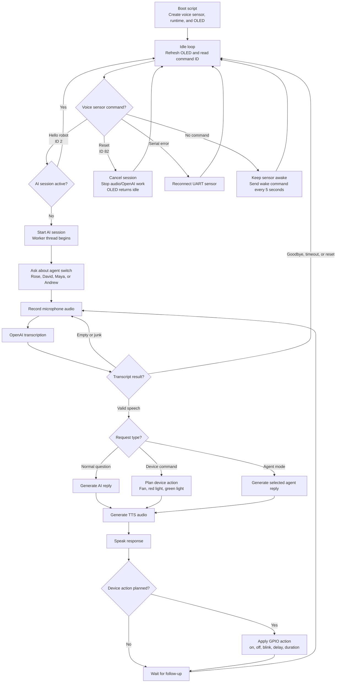

# Flow Charts

This section explains the final system flow for the Smart Voice Home Assistant based on the current code in `code/voice_test_openai.py` and `code/home_assistant_ai/pi_voice_runtime_openai.py`.

## Final Code Flow

Source file: [`final-code-flow.mmd`](final-code-flow.mmd)

## Flow Summary

- `voice_test_openai.py` runs continuously on the Raspberry Pi.
- The DFRobot voice recognition sensor reports command IDs.
- Command ID `2` starts a new AI session when no session is active.
- Command ID `82` cancels the active session and returns the OLED to idle.
- `PiVoiceRuntimeOpenAI` runs the conversation in a worker thread so the main loop can keep reading the sensor.
- At session start, the runtime asks whether the user wants to change agent.
- During the conversation window, the runtime records audio, transcribes with OpenAI, routes the transcript, generates a reply, speaks with TTS, and optionally applies GPIO device actions.
- The session ends on reset, timeout, goodbye phrase, missing reply, or cancellation.

## Device Outputs

| Device | GPIO | Supported actions |
| --- | --- | --- |
| Fan | GPIO16 | on, off, blink, delay, duration |
| Red light | GPIO20 | on, off, blink, delay, duration |
| Green light | GPIO21 | on, off, blink, delay, duration |
