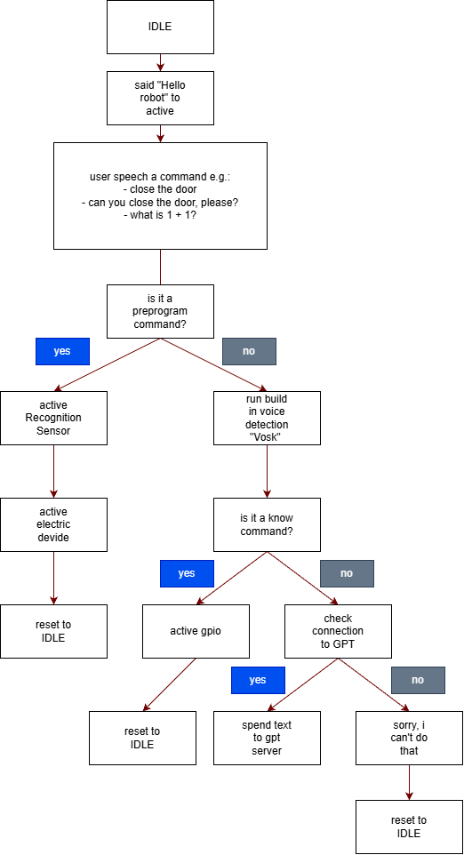
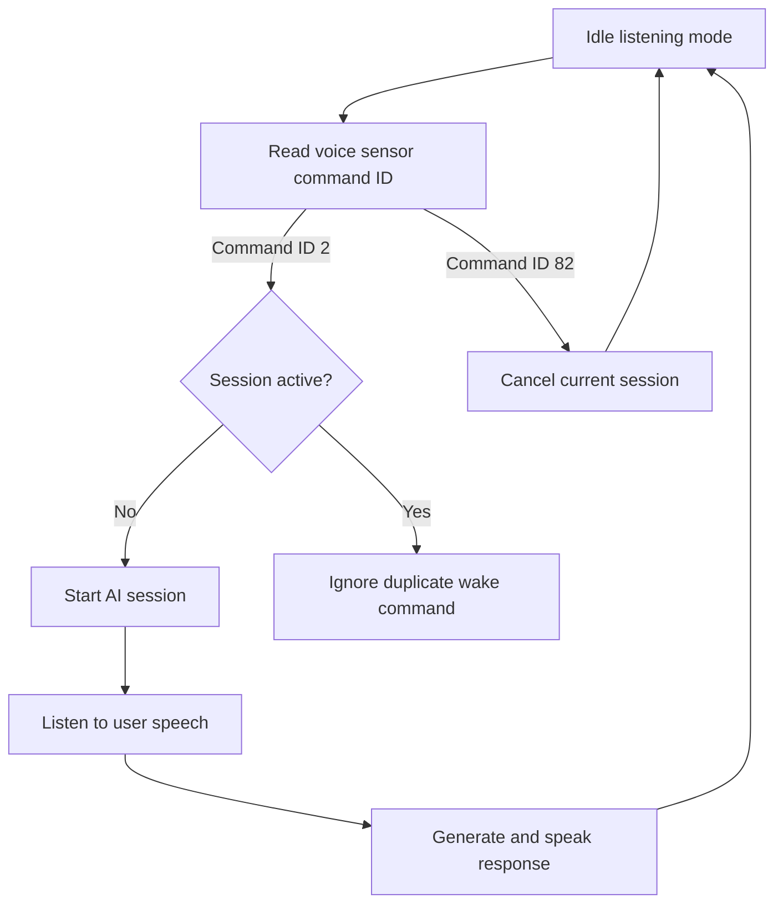
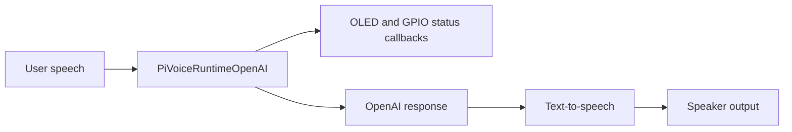

# Flow Charts

This section explains the main system flow for the Smart Voice Home Assistant.

## System Flow



The original editable diagram is included as:

```text
system-flowchart.drawio
```

## Wake Word Flow



## GPT Response Flow



## Notes

- The dedicated sensor handles wake and reset commands.
- The Python runtime handles the active conversation session.
- OLED and GPIO output give the user live feedback about the assistant state.
