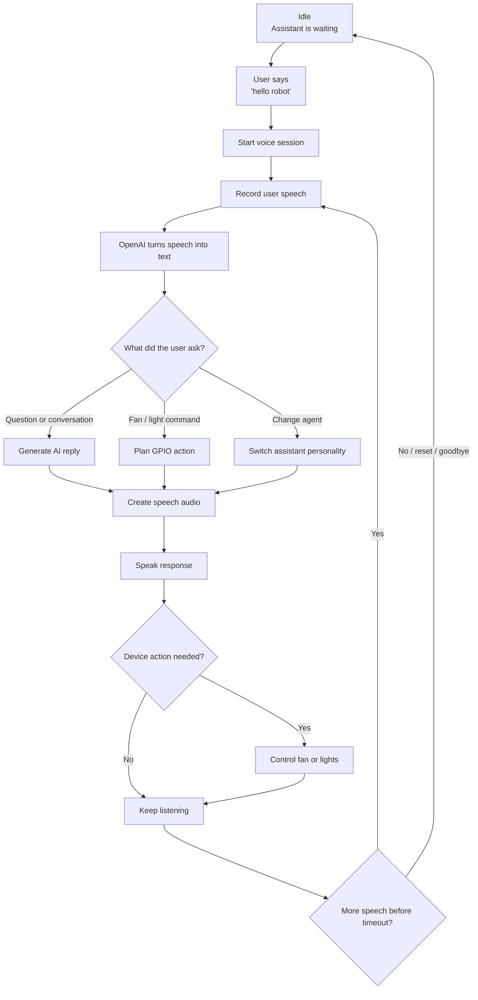

# Flow Charts

This section explains the final system flow for the Smart Voice Home Assistant based on the current code in `code/voice_test_openai.py` and `code/home_assistant_ai/pi_voice_runtime_openai.py`.

## Final Code Flow

Source file: [`final-code-flow.mmd`](final-code-flow.mmd)

## Flow Summary

- The assistant waits in idle mode.
- The user says `hello robot`.
- The Raspberry Pi records the user's speech.
- OpenAI turns the speech into text.
- The code decides whether the user asked a normal question, a device command, or an agent change.
- The assistant speaks a response.
- If needed, the Raspberry Pi controls the fan, red light, or green light.
- The assistant keeps listening until the user stops, says goodbye, resets, or the session times out.

## Device Outputs

| Device | GPIO | Supported actions |
| --- | --- | --- |
| Fan | GPIO16 | on, off, blink, delay, duration |
| Red light | GPIO20 | on, off, blink, delay, duration |
| Green light | GPIO21 | on, off, blink, delay, duration |
