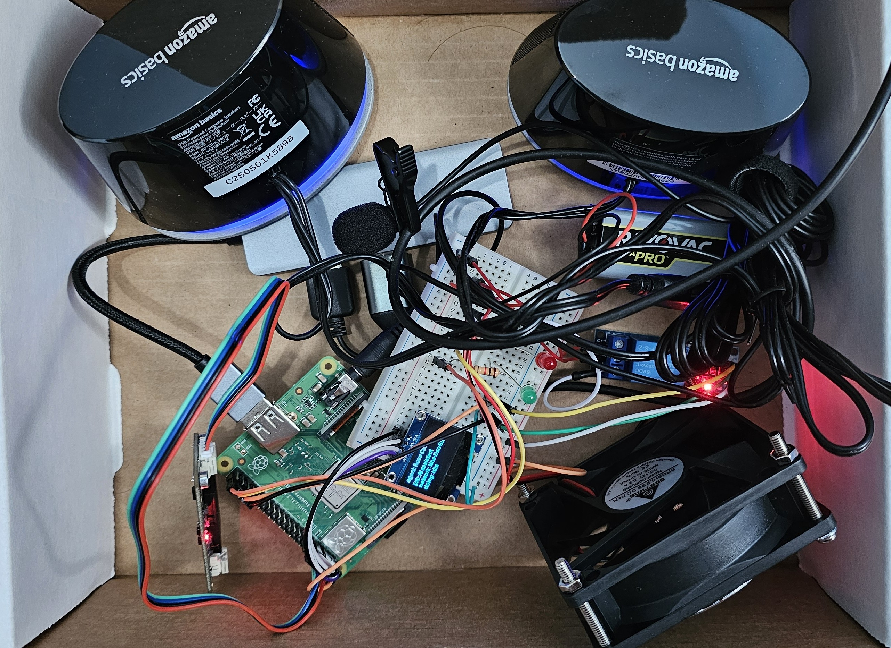

# Mechanical Build

This section describes the physical build of the Smart Voice Home Assistant.

## Build Overview

The prototype is based on a Raspberry Pi with connected voice input, display output, and GPIO-controlled devices. The early build focused on proving that the software and hardware could communicate correctly before designing a final enclosure.

## Prototype Photo

This photo shows the current mechanical prototype layout, including the Raspberry Pi, OLED display, breadboard wiring, microphone, speakers, GPIO wiring, and fan/relay hardware arranged inside the project box.

## Physical Components

- Raspberry Pi main board
- microSD card with Raspberry Pi OS
- USB lavalier microphone
- Speakers for voice output
- DFRobot voice recognition sensor
- OLED display
- Breadboard wiring
- Fan / relay hardware
- GPIO-connected fan/status indicators
- Jumper wires and prototype wiring

## Prototype Setup

1. Flash Raspberry Pi OS to the microSD card.
2. Boot the Raspberry Pi with keyboard, mouse, monitor, and HDMI adapter.
3. Enable SSH, VNC, and serial communication.
4. Connect the recognition sensor to Raspberry Pi UART pins.
5. Connect OLED through I2C.
6. Connect GPIO outputs for fan and status LEDs.
7. Run the Python assistant script from the Raspberry Pi home folder.

## Remote Access

The project uses remote access to make development easier:

- PuTTY / SSH for terminal access
- RealVNC for desktop access
- Local network IP lookup for connecting from a PC

Screenshot evidence is stored in [media/screenshots](../../media/screenshots/).

## Final Enclosure Status

Final enclosure design is to be added. The current build is a working prototype focused on function, wiring, and software behavior.
